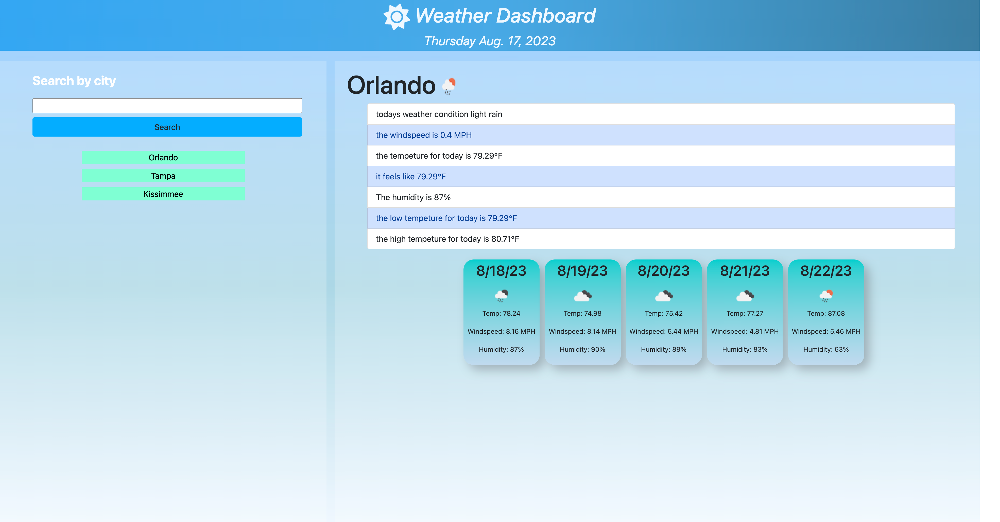

# Weather-Dashboard

## Description
The reason for this application is to provide information about a cities current weather and 5 day forecast. it is done by using apis to obtain data based on the city that is typed on the search bar. the application also saves the users search history in the form of useable buttons

## Usage
To use this application the user starts by typing the name of a city once this is done and the user clicks the submit button and they will be presented with a current the name of the city, the date, windspeed, humidity, temp, and an img representing the weather the user will also receive a 5 day forecast with same properties. also a button with the text of the city the user typed will be created. if the user were to click one of those buttons the data that will show will be for that city. the buttons created will also be save to local storage so if the user logs back in they can continue where they left of.
here is a link to the application https://sam-dejesus.github.io/Weather-Dashboard2/
here is an image of the application 

## Credits
- https://openweathermap.org/
- https://day.js.org/

## License
MIT License

Copyright (c) 2023 Samuel DeJesus

Permission is hereby granted, free of charge, to any person obtaining a copy of this software and associated documentation files (the "Software"), to deal in the Software without restriction, including without limitation the rights to use, copy, modify, merge, publish, distribute, sublicense, and/or sell copies of the Software, and to permit persons to whom the Software is furnished to do so, subject to the following conditions:

The above copyright notice and this permission notice shall be included in all copies or substantial portions of the Software.

THE SOFTWARE IS PROVIDED "AS IS", WITHOUT WARRANTY OF ANY KIND, EXPRESS OR IMPLIED, INCLUDING BUT NOT LIMITED TO THE WARRANTIES OF MERCHANTABILITY, FITNESS FOR A PARTICULAR PURPOSE AND NONINFRINGEMENT. IN NO EVENT SHALL THE AUTHORS OR COPYRIGHT HOLDERS BE LIABLE FOR ANY CLAIM, DAMAGES OR OTHER LIABILITY, WHETHER IN AN ACTION OF CONTRACT, TORT OR OTHERWISE, ARISING FROM, OUT OF OR IN CONNECTION WITH THE SOFTWARE OR THE USE OR OTHER DEALINGS IN THE SOFTWARE.